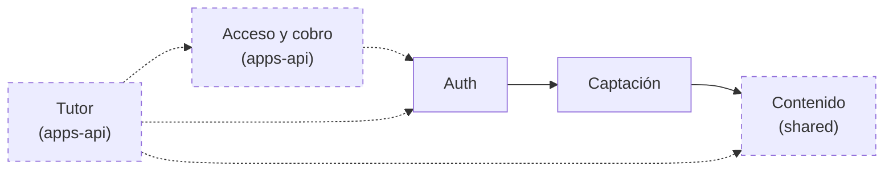

# SYSTEM_ARTIFACT

**Project**: apps-web (`OSL-LMS/platform`, paquete `apps/web`)
**Last updated**: 2026-07-31
**Version**: 0.1.0
**Maintainers**: mantenedores del repo OSL

<!--
  Estado actual de ESTE paquete, por dominio. Documento vivo: describe lo que
  HAY, no lo que vendrá. Los PRD son fotos congeladas; este archivo gana si
  discrepan.

  Uno por sibling desde 2026-07-31, cuando SIBLINGS.md pasó de una fila a tres.
  El anterior cubría el repositorio entero y vive en el historial de git; los
  `system_artifact_diff` de PRD-002 a PRD-006 lo citan por ruta Y commit.

    apps-web  → apps/web/docs/SYSTEM_ARTIFACT.md
    apps-api  → apps/api/docs/SYSTEM_ARTIFACT.md
    shared    → packages/shared/docs/SYSTEM_ARTIFACT.md

  Los dominios que cruzan la frontera están PARTIDOS: cada mitad vive con el
  código que la implementa y referencia a la otra por nombre, en la sección
  "Dominios que viven en otro paquete".
-->

---

## How to maintain this document

Léelo antes de editar.

1. **Un cambio por commit.** Cada actualización va atada a un PRD que llega a `Implemented`, o a un arreglo directo de deriva observada.
2. **En el mismo commit que el código.** Al promocionar un PRD, el diff contra este archivo es uno de los tres campos del gate (`system_artifact_diff`). Si un cambio toca dos paquetes, se actualizan los dos documentos y el gate lista los dos.
3. **Describe lo que ES, no lo que vendrá.** Aquí no hay secciones de "futuro" ni "propuesto". El trabajo futuro vive en los PRD.
4. **Agrupa por dominio, no por cronología.** Quien lea esto debe aprender el sistema por fronteras de dominio, no por el orden en que se construyeron las cosas.
5. **Enlaza al PRD que introdujo cada capacidad** para que el lector encuentre la razón original. No dupliques esa razón aquí.
6. **Diagramas sólo en Mermaid.** Nada de ASCII. Tablas y listas anidadas no cuentan como diagrama.

---

## Domain Map

<!-- Los dominios de ESTE paquete y de qué dependen. Lo punteado vive en otro
     sibling: se dibuja para que la dependencia se vea, no para documentarla
     aquí. -->

---

## Domain: `captacion`

**Source PRDs**: — (anterior a la adopción de specforge)
**Primary owners**: mantenedores del repo

### Overview

La parte ancha del embudo: capturar correos de quien llega desde el directo de Twitch o los VOD, y avisarles de cada clase. La lista propia (`registrations`) es el activo que sobrevive a las plataformas; está deliberadamente separada de `user`, que es el login al tutor.

### Key Entities

#### `registrations`

| Column | Type | Notes |
|---|---|---|
| id | uuid | pk, `defaultRandom()` |
| email | text | not null, **unique** — la llave del embudo |
| name | text | opcional |
| current_lesson | text | lección declarada en el formulario, p. ej. `"L1"` |
| source | text | `"web"` (formulario) o `"signin"` (alta implícita al entrar) |
| created_at | timestamp | `defaultNow()` |

### Main Capabilities

| Capability | Surface | Introduced in |
|---|---|---|
| Registro público (correo, nombre, lección, CTA de origen) | `register()` server action — `apps/web/src/app/registro/actions.ts` | — |
| Correo de bienvenida best-effort vía Resend | dentro de `register()` | — |
| Aviso de clase a toda la lista (dry-run / `--test` / `--send`) | `scripts/send-class-email.mjs` | — |
| Alta implícita al iniciar sesión | evento `signIn` en `apps/web/src/auth.ts` | — |

### Key Invariants

- El correo se normaliza (`trim().toLowerCase()`) antes de tocar la base de datos. Es la llave que une `registrations`, `subscriptions`, Paddle y PostHog.
- La inserción es idempotente (`onConflictDoNothing` sobre `email`): reregistrarse no es un error para el usuario.
- El envío de correo es best-effort — un fallo de Resend nunca invalida el registro ya guardado.
- `apps/web/src/auth.ts` inserta en `registrations` dentro de un `try/catch` vacío: un fallo ahí jamás rompe el login.
- El campo `src` del formulario se filtra contra una allowlist (`header`, `hero`, `demo`, `cierre`) antes de llegar a la telemetría.

### Open Debt

- `scripts/send-class-email.mjs` no gestiona bajas (marcado `ponytail:` en el archivo); el texto del correo pide responder para salir. Escalará a Resend Broadcasts o un ESP cuando la lista lo justifique.
- El asunto y el cuerpo del aviso de clase están hardcodeados en el script y se editan a mano cada semana.

---

---

## Domain: `auth`

**Source PRDs**: — (anterior a la adopción de specforge)
**Primary owners**: mantenedores del repo

### Overview

Login sin contraseña por magic link (Auth.js v5 + provider Resend). Los usuarios y los tokens viven en la Postgres propia vía el Drizzle adapter, pero la sesión es JWT en cookie para que el middleware la valide en el runtime Edge sin tocar la base de datos.

### Key Entities

Tablas con la forma canónica que exige el Drizzle adapter de Auth.js v5 — nombres en singular, sin mapeo personalizado.

#### `user`

| Column | Type | Notes |
|---|---|---|
| id | text | pk, `crypto.randomUUID()` |
| email | text | unique |
| emailVerified | timestamp | lo escribe el flujo de magic link |
| name, image | text | del adapter |

#### `account`, `session`, `verificationToken`

Forma canónica del adapter. `account` y `session` tienen `onDelete: cascade` contra `user.id`; `verificationToken` sostiene el flujo de magic link con pk compuesta `(identifier, token)`.

### Main Capabilities

| Capability | Surface | Introduced in |
|---|---|---|
| Handlers de Auth.js | `GET/POST /api/auth/[...nextauth]` | — |
| Pantalla de login propia en español | `/signin` (`pages.signIn`) | — |
| Protección de la app del tutor | `apps/web/src/middleware.ts`, matcher `["/chat", "/chat/:path*"]` | — |
| Cierre de sesión | `logout()` server action — `apps/web/src/app/actions.ts` | — |

### Key Invariants

- **La sesión expone `session.user.id` (string)**. Es un contrato: la persistencia de conversaciones depende de él.
- `apps/web/src/auth.config.ts` es edge-safe — sin adapter, sin `pg`, sin providers. Meter cualquiera de los tres ahí rompe el middleware en el Edge runtime.
- El middleware protege **solo** `/chat`. Landing, precios, registro, legales, `/checkout` y `/signin` son públicas a propósito (Paddle debe poder verificarlas sin login).
- `trustHost: true` porque Railway corre detrás de un proxy.
- La clave de Resend se lee de `AUTH_RESEND_KEY` con respaldo a `RESEND_API_KEY`; el remitente verificado es `tutor@angelkurten.com`.

### Open Debt

- Solo hay provider de correo; no existe OAuth pese a que la tabla `account` está creada.

---

---

## Cross-cutting concerns

---

### Shared middleware

`apps/web/src/middleware.ts` es el único; valida el JWT de sesión en el Edge runtime y redirige a `/signin`. Alcance: `/chat` y subrutas.

---

### Observability

- **Embudo server-side** (`apps/web/src/lib/analytics.ts`, `posthog-node`): eventos `registered` → `trial_started` → `tutor_message_sent` → `subscription_activated` / `subscription_canceled`. El `distinct_id` es siempre el correo. El union `TutorEvent` impide que un typo invente un evento y parta el embudo.
- **`tutor_message_sent` ya no lleva `access_ms`.** Lo emitía el handler local midiendo el puente; desde PRD-005 el turno vive en `apps/api` y `ensureTrial` es una llamada en proceso, así que ese número dejó de existir. La señal de ADR-001 § 6 pasa a ser **`first_token_ms`**, una línea de log por turno. El evento conserva `access_status` y `lesson`, y se sigue emitiendo **al aceptar** el turno, no al cerrarlo: mide que el estudiante habló con el tutor, y eso ya pasó aunque Anthropic falle después.
- **`first_token_ms` lleva prefijo por proceso, y no es cosmético**: `[TutorService]` en `apps/api`, `[tutor]` en la raíz. Es lo único que permite atribuir un turno al camino que lo sirvió — durante el corte sirvió para descubrir que un turno que se creía proxyado lo había servido el camino local.
- **Dos contadores más, los dos enteros y sin contenido** (§ 8.3 del PRD): `descartadas=<n>` cuando el saneado del hilo tira entradas al leer, y la línea `name=`/`code=` cuando falla la persistencia — que desde PRD-005 significa amnesia y no solo un guardado perdido.
- `track()` es fire-and-forget y **nunca se hace `await`** en el call site; sin `POSTHOG_API_KEY` es un no-op silencioso (protegido por `scripts/check-analytics.ts`). `flush()` existe para los procesos cortos de `scripts/`.
- **Denominador anónimo**: `GET /api/t` sirve un GIF 1×1 y emite `server_pageview`. El `distinct_id` es `sha256(ip|ua|día|ANALYTICS_SALT)` truncado — sal que rota a diario, así que no persiste ni permite seguimiento entre días; por eso no requiere consentimiento. **La sal dejó de ser `AUTH_SECRET` en PRD-003**, que la replicó a un segundo servicio: quien tuviera el secreto podía romper la anonimidad por fuerza bruta sobre (IP × UA × día). Y **falla cerrado**: sin `ANALYTICS_SALT` el píxel devuelve el GIF y no emite, nunca `?? ""` — con sal vacía el hash lo reproduce cualquiera sin conocer ningún secreto, que es peor que no medir. Solo cuenta rutas de `PUBLIC_PATHS` (`/`, `/registro`, `/precios`, `/signin`) y descarta user-agents de bot. Las UTM se leen del `Referer` del píxel.
- **Medición en el navegador** (`posthog-js`, incluido session replay en páginas públicas): opt-in real tras el banner `analytics-consent-v2`. Hasta que el visitante acepta no se carga ni un byte; si rechaza, no se vuelve a preguntar. El embudo server-side no depende de esa elección.
- El resto es `console.error` en los puntos donde se traga un fallo a propósito (persistencia del chat, webhook, envío de correo).
- **En `apps/api` el registro de errores es una allowlist por campo, de servicio y no de un `catch`**: un filtro de excepciones global emite `err.name` y el código, buscado en `cause.code` y si no en `code`, y **nunca** `message`, `stack`, el objeto **ni `detail`**. Ése es el campo que hay que nombrar: `DrizzleQueryError` mete los parámetros ligados —con el correo— dentro de `message`, y un `DatabaseError` de `pg` sin envolver trae `detail` con `Key (email)=(alguien@ejemplo.test) already exists`. El código pasa además un guarda de forma (`/^[A-Za-z0-9_]{1,32}$/`), porque que `code` sea un identificador corto es convención de Node y de `pg`, no contrato. **El filtro no puede extender `BaseExceptionFilter`**: su `super.catch()` registra el objeto entero y mete `exception.message` en el cuerpo de la respuesta, reintroduciendo la fuga por dos vías.
- El `catch` del webhook **se conserva** pese a existir el filtro global: el 200 que evita el bucle de reintentos de Paddle depende de capturar, así que ese error nunca llega al filtro.
- **Al leer la tasa de 400 de `/v1/webhooks/paddle`** —la señal que vigila el desfase de reloj contra la ventana de 5 s de Paddle— hay que contar solo los que **no** dejan línea de `AllExceptionsFilter`. Los 400 de firma inválida son `BadRequestException` y el filtro no los registra; los de cuerpo malformado o demasiado grande sí, con `name=SyntaxError` o `name=PayloadTooLargeError`, y cualquiera desde internet puede inflarlos sin firma.
- **Y ese 400 "de firma inválida" tiene tres causas, no una.** El `catch` que lo produce envuelve la llamada entera a `unmarshal`, así que además de la firma falsa y del `ts` fuera de ventana atrapa un tercer caso: **una firma correcta sobre un payload que el SDK no puede construir**. Los constructores de evento de Paddle exigen campos que un payload de prueba escueto no trae (`billing_cycle.interval`, por ejemplo) y lanzan; el resultado es indistinguible de un secreto equivocado, sin línea de log que lo separe. Comprobado al ejercitar el servicio: un `subscription.activated` con solo `id` y `status` devuelve `"firma inválida"` con la firma perfectamente válida. Es comportamiento heredado del handler de Next, portado tal cual — pero al depurar un webhook, descartar el payload antes que el secreto ahorra la tarde.

---

## Dominios que viven en otro paquete

Cuatro dominios cruzan la frontera. Aquí queda **sólo** la mitad que implementa `apps/web`; la otra está en el documento del paquete que la sirve.

- **`acceso`** → `apps/api/docs/SYSTEM_ARTIFACT.md`. Aquí sólo queda el puente (`src/lib/api-client.ts`) y el lado navegador del checkout (`paywall.tsx`, `/checkout`). **Deuda conocida**: `fetchAccess()` y `fetchAccessTrial()` **no** declaran `redirect: "manual"`, y arrastran el hueco que `streamTutorTurn()` y el puente de evidencia sí cierran — undici retira `authorization` solo en un redirect cross-origin, así que uno same-origin reenviaría el Bearer a una ruta que nadie decidió y un 3xx cross-origin lo descartaría en silencio dando un 401 que se lee como "tu sesión expiró". `apps/api` no tiene un solo redirect en su tabla de rutas, así que hoy no es alcanzable; es limpieza, no incidente. Detectado en la re-revisión post-implementación de PRD-007 y fuera de su alcance. Ninguna decisión de acceso o cobro se toma en este proceso: se piden a `/v1/access*` y se degrada si no responden. Quien depure por qué alguien tiene o no acceso, mira allí.
- **`tutor`** → `apps/api/docs/SYSTEM_ARTIFACT.md`. Aquí queda el proxy (`src/app/api/chat/route.ts`), que reenvía cookie→Bearer y devuelve el stream sin bufferizar, y la UI del chat. El prompt, la ventana de contexto, la memoria y la clave de Anthropic no están en este proceso — y el guarda de `src/lib/tutor-turn.ts` impide arrancarlo si la clave aparece en su entorno.
- **`contenido`** → `packages/shared/docs/SYSTEM_ARTIFACT.md`. Aquí queda el renderizado: la home, `/registro` y `/chat` leen el currículo por `@shared/curriculum`. El parser, el control de URLs y las invariantes del archivo publicado viven en `shared`.
- **`evidencia`** → `apps/api/docs/SYSTEM_ARTIFACT.md`. Aquí queda el proxy (`src/app/api/evidence/route.ts`), el puente (`submitEvidence()`/`fetchEvidence()` en `src/lib/api-client.ts`), **las decisiones puras del panel** (`src/lib/evidence-panel.ts`) y su render en `chat-client.tsx`. La tabla, el verificador de URLs y los ocho controles de SSRF viven en `apps/api`.

  **Tres cosas de esta mitad no son obvias:**

  - **El `role` de la línea de estado sale de `evidence-panel.ts`, no del JSX**, tipado como el literal `"status"` sin otro miembro. Emitir `role="alert"` exigiría contradecir visiblemente el módulo, no olvidarse — y el patrón equivocado está a cincuenta líneas, en la caja de error del tutor. Un fallo de comprobación es un estado de la comprobación, no del estudiante: tratamiento neutro y accionable, nunca rojo de alerta, nunca la palabra "error".
  - **La región viva se monta siempre**, fuera del condicional que pinta el panel. Una región viva tiene que existir en el árbol de accesibilidad **antes** de que su contenido cambie; naciendo con el texto ya dentro no se anuncia de forma fiable, y el caso afectado es justo el estudiante que vuelve y cuya lección ya tenía evidencia.
  - **`checkEvidenceUrl()` es un atajo de mensaje, no un control.** El puente aplica la regla positiva, así que un 400 del `ValidationPipe` llega como el mismo `{error:true}` que un 503 — o sea, como "reinténtalo", que para un esquema equivocado es falso porque reintentar falla igual. Comprueba esquema y puerto, y **nada del servidor se relajó** dando por hecho que el cliente comprueba primero.

---

## Comprobaciones

Scripts de `assert` bajo Node pelado, en `scripts/`, sin framework. Se invocan por las entradas `check:*` de `package.json`. Siete: `check-access-bridge.ts`, `check-analytics.ts`, `check-evidence-bridge.ts`, `check-format-message.ts`, `check-schedule.ts`, `check-tutor-turn.ts`, `check-secrets.ts`.

**Una entrada en `package.json` NO ejecuta nada.** `.github/workflows/checks.yml` lista un paso explícito por script y no invoca ningún agregado, así que un script nuevo necesita **las dos** cosas: su entrada `check:*` y su paso en el workflow. Pasó una vez con `check:secrets`, que existió sin correr; PRD-007 lo evitó por poco con `check:evidence` porque un revisor lo cazó.

**Node pelado borra los tipos, no los comprueba.** Una invariante de tipos no cabe aquí: va como fixture con `@ts-expect-error` que typechequea `next build`. `src/lib/analytics.type-test.ts` es la única y **no la importa nadie a propósito** — afirma que este proceso no puede emitir el evento de auditoría del embudo. Si alguien vuelve a ensanchar el tipo de `track()`, el build se pone rojo por la directiva sin usar.

**`check-secrets.ts` es un tripwire, no un test de unidad.** Afirma que el guarda de `ANTHROPIC_API_KEY` sigue **armado**: que `src/app/api/chat/route.ts` importa `tutor-turn.ts` por efecto, y que la llamada al guarda sigue descomentada. Las dos aserciones están ancladas a principio de línea: sin el ancla, *comentar* el import dejaba el tripwire en verde con el guarda desactivado.

---

## Entorno y despliegue

Next.js 15 (App Router) + React 19, `pnpm@11.4.0`, desplegado en Railway como servicio `tutor-app` con **Nixpacks**, no con Dockerfile.

**El arranque pasa por la raíz del repositorio y es deliberado.** Railway ejecuta el script `start` del `package.json` de la raíz para servicios enlazados a repositorio; ese script delega aquí con `pnpm --filter web`. Eso es lo que permitió mover esta app de la raíz a `apps/web` sin tocar una sola variable ni servicio de Railway. Verificado con `nixpacks plan` antes del corte: genera plan y detecta Next dentro de `apps/web` por su cuenta.

**Dos variables tienen que existir o el build falla**, no el runtime: `AUTH_COOKIE_NAME` y `API_BASE_URL`. `src/lib/api-client.ts` valida su configuración a nivel de módulo y `next build` importa los módulos de página al recolectar rutas. Ninguna de las dos es secreto.

**Las `NEXT_PUBLIC_*` de Paddle y PostHog deben existir en tiempo de build** para quedar inlineadas. Sin ellas el build sale verde e inlinea `undefined`: lo que degrada es el runtime.

**`/`, `/registro` y `/chat` son dinámicas** (`ƒ`). Las dos primeras llaman `connection()` para salir del prerender de build, donde `DATABASE_URL` no existe; `/chat` lo es por leer cookies. Lo que evita que consulten Postgres en cada visita es el caché de `@shared/curriculum` (TTL 600 s), no un export de página.

**`output: "standalone"` se construye y no se usa**: el arranque es `next start`. Next avisa de la combinación en cada arranque. Desperdicio conocido y declarado.

El archivo de secretos local es `apps/web/.env.local` — el proceso corre con este directorio como cwd. `.env.example` sigue en la raíz y documenta los tres servicios.

---

## Change log

| Date | PRD | Summary |
|---|---|---|
| 2026-07-31 | PRD-007 | Mitad web del dominio `evidencia`: proxy, puente, decisiones puras del panel y su render junto al selector de lección de `/chat`. `/registro` **no** cambió — sigue con `toLessonOptions`, que es lo que impide publicar el texto de evidencia a un visitante anónimo. |
| 2026-07-31 | — | **El documento vivo se parte en tres**, uno por sibling, al pasar `SIBLINGS.md` de una fila a tres. El anterior vivía en `platform/docs/SYSTEM_ARTIFACT.md` y sigue disponible en el historial de git: los `system_artifact_diff` de PRD-002 a PRD-006 lo citan por ruta **y commit**, así que resuelven ahí y no en disco. Los dominios que cruzaban paquetes quedaron partidos, con la mitad de cada uno referenciando a la otra por nombre. |
