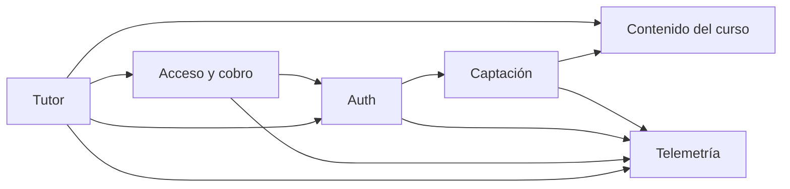

# SYSTEM_ARTIFACT

**Project**: platform (`OSL-LMS/platform`)
**Last updated**: 2026-07-27
**Version**: 0.1.0
**Maintainers**: mantenedores del repo OSL

<!--
  Estado actual del sistema, por dominio. Documento vivo: describe lo que HAY,
  no lo que vendrá. Los PRD son fotos congeladas; este archivo gana si discrepan.
  Bootstrapeado desde el código en el commit f2b948e — ningún PRD lo precede
  (specforge se adoptó después). La columna "Introduced in" queda vacía hasta
  que el primer PRD toque cada capacidad.
-->

---

## How to maintain this document

1. **Un cambio por commit**, atado a un PRD que llega a `Implemented` o a una corrección de deriva observada.
2. **Se actualiza en el mismo commit que el código** — es uno de los tres campos del gate (`system_artifact_diff`).
3. **Describe lo que es**, no lo que se planea. El futuro vive en los PRD.
4. **Agrupa por dominio**, no por cronología.
5. **Enlaza el PRD que introdujo cada capacidad**; no dupliques aquí su justificación.
6. **Diagramas solo en Mermaid.**

---

## Domain Map

---

## Domain: `captacion`

**Source PRDs**: — (anterior a la adopción de specforge)
**Primary owners**: mantenedores del repo

### Overview

La parte ancha del embudo: capturar correos de quien llega desde el directo de Twitch o los VOD, y avisarles de cada clase. La lista propia (`registrations`) es el activo que sobrevive a las plataformas; está deliberadamente separada de `user`, que es el login al tutor.

### Key Entities

#### `registrations`

| Column | Type | Notes |
|---|---|---|
| id | uuid | pk, `defaultRandom()` |
| email | text | not null, **unique** — la llave del embudo |
| name | text | opcional |
| current_lesson | text | lección declarada en el formulario, p. ej. `"L1"` |
| source | text | `"web"` (formulario) o `"signin"` (alta implícita al entrar) |
| created_at | timestamp | `defaultNow()` |

### Main Capabilities

| Capability | Surface | Introduced in |
|---|---|---|
| Registro público (correo, nombre, lección, CTA de origen) | `register()` server action — `src/app/registro/actions.ts` | — |
| Correo de bienvenida best-effort vía Resend | dentro de `register()` | — |
| Aviso de clase a toda la lista (dry-run / `--test` / `--send`) | `scripts/send-class-email.mjs` | — |
| Alta implícita al iniciar sesión | evento `signIn` en `src/auth.ts` | — |

### Key Invariants

- El correo se normaliza (`trim().toLowerCase()`) antes de tocar la base de datos. Es la llave que une `registrations`, `subscriptions`, Paddle y PostHog.
- La inserción es idempotente (`onConflictDoNothing` sobre `email`): reregistrarse no es un error para el usuario.
- El envío de correo es best-effort — un fallo de Resend nunca invalida el registro ya guardado.
- `src/auth.ts` inserta en `registrations` dentro de un `try/catch` vacío: un fallo ahí jamás rompe el login.
- El campo `src` del formulario se filtra contra una allowlist (`header`, `hero`, `demo`, `cierre`) antes de llegar a la telemetría.

### Open Debt

- `scripts/send-class-email.mjs` no gestiona bajas (marcado `ponytail:` en el archivo); el texto del correo pide responder para salir. Escalará a Resend Broadcasts o un ESP cuando la lista lo justifique.
- El asunto y el cuerpo del aviso de clase están hardcodeados en el script y se editan a mano cada semana.

---

## Domain: `auth`

**Source PRDs**: — (anterior a la adopción de specforge)
**Primary owners**: mantenedores del repo

### Overview

Login sin contraseña por magic link (Auth.js v5 + provider Resend). Los usuarios y los tokens viven en la Postgres propia vía el Drizzle adapter, pero la sesión es JWT en cookie para que el middleware la valide en el runtime Edge sin tocar la base de datos.

### Key Entities

Tablas con la forma canónica que exige el Drizzle adapter de Auth.js v5 — nombres en singular, sin mapeo personalizado.

#### `user`

| Column | Type | Notes |
|---|---|---|
| id | text | pk, `crypto.randomUUID()` |
| email | text | unique |
| emailVerified | timestamp | lo escribe el flujo de magic link |
| name, image | text | del adapter |
| current_lesson | text | columna propia — **hoy sin uso** (ver Open Debt) |

#### `account`, `session`, `verificationToken`

Forma canónica del adapter. `account` y `session` tienen `onDelete: cascade` contra `user.id`; `verificationToken` sostiene el flujo de magic link con pk compuesta `(identifier, token)`.

### Main Capabilities

| Capability | Surface | Introduced in |
|---|---|---|
| Handlers de Auth.js | `GET/POST /api/auth/[...nextauth]` | — |
| Pantalla de login propia en español | `/signin` (`pages.signIn`) | — |
| Protección de la app del tutor | `src/middleware.ts`, matcher `["/chat", "/chat/:path*"]` | — |
| Cierre de sesión | `logout()` server action — `src/app/actions.ts` | — |

### Key Invariants

- **La sesión expone `session.user.id` (string)**. Es un contrato: la persistencia de conversaciones depende de él.
- `src/auth.config.ts` es edge-safe — sin adapter, sin `pg`, sin providers. Meter cualquiera de los tres ahí rompe el middleware en el Edge runtime.
- El middleware protege **solo** `/chat`. Landing, precios, registro, legales, `/checkout` y `/signin` son públicas a propósito (Paddle debe poder verificarlas sin login).
- `trustHost: true` porque Railway corre detrás de un proxy.
- La clave de Resend se lee de `AUTH_RESEND_KEY` con respaldo a `RESEND_API_KEY`; el remitente verificado es `tutor@angelkurten.com`.

### Open Debt

- `user.current_lesson` no se escribe ni se lee en ningún sitio: la lección viaja por petición en el body de `/api/chat`. Columna muerta.
- Solo hay provider de correo; no existe OAuth pese a que la tabla `account` está creada.

---

## Domain: `acceso`

**Source PRDs**: — (anterior a la adopción de specforge)
**Primary owners**: mantenedores del repo

### Overview

La frontera gratis/pago. Trial de 7 días sin tarjeta que **arranca con el primer mensaje al tutor**, no al hacer login: entrar a curiosear no gasta la prueba. Vencido el trial o cancelada la suscripción, el chat se sustituye por el muro de pago (Paddle).

### Key Entities

#### `subscriptions`

| Column | Type | Notes |
|---|---|---|
| id | uuid | pk, `defaultRandom()` |
| email | text | not null, **unique** — la llave que enlaza con Paddle |
| status | enum `subscription_status` | `trial` \| `active` \| `canceled`, default `trial` |
| trial_ends_at | timestamp | fin del trial de 7 días |
| paddle_subscription_id | text | lo escribe el webhook |
| created_at / updated_at | timestamp | `defaultNow()` |

El estado derivado que consume la app es `Access = { allowed, status: "none" \| "trial" \| "active" \| "canceled", trialDaysLeft }`. `"none"` (sin fila) significa "aún no ha hablado con el tutor" y **permite ver el chat**.

### Main Capabilities

| Capability | Surface | Introduced in |
|---|---|---|
| Leer acceso sin efectos secundarios | `getAccess(email)` — `src/lib/access.ts` | — |
| Crear el trial y devolver acceso | `ensureTrial(email)` — llamado **solo** desde `/api/chat` | — |
| Webhook de Paddle | `POST /api/paddle/webhook` | — |
| Muro de pago con checkout de Paddle | `src/app/paywall.tsx` | — |
| Payment link por defecto de Paddle (`?_ptxn=`) | `/checkout` (pública) | — |
| Utilidades de dev: consultar / vencer un trial | `scripts/check-sub.mjs`, `scripts/expire-trial.mjs` | — |

### Key Invariants

- **`getAccess` solo lee; `ensureTrial` es el único que crea la fila**, y se invoca exclusivamente desde `POST /api/chat`. Renderizar `/chat` nunca arranca la prueba.
- El evento `trial_started` se emite **solo** cuando ese request creó la fila (`returning()` no vacío): un trial, un evento. La carrera de dos primeros mensajes simultáneos se resuelve releyendo la fila tras el `onConflictDoNothing`.
- El webhook **debe leer el body crudo con `req.text()`**; `req.json()` rompe la verificación de firma del SDK de Paddle.
- El webhook responde **200 incluso ante un error propio** (lo registra en consola) para que Paddle no reintente en bucle. Firma inválida o evento ausente sí devuelven 400.
- El correo llega desde Paddle en `customData.email` del checkout y se pasa a minúsculas antes del `UPDATE`.
- El entorno de Paddle es `sandbox` salvo que `PADDLE_ENV`/`NEXT_PUBLIC_PADDLE_ENV` valga exactamente `production`.

### Open Debt

- El webhook actualiza por `email`; si Paddle envía un evento cuyo `customData.email` no tiene fila en `subscriptions`, el `UPDATE` afecta 0 filas en silencio.
- No hay reconciliación periódica contra la API de Paddle: si un webhook se pierde, el estado queda desincronizado hasta el siguiente evento.
- `EventName.SubscriptionUpdated` deriva `canceled` de `data.status`; el resto de estados de Paddle (`paused`, `past_due`) caen a `active`.

---

## Domain: `tutor`

**Source PRDs**: — (anterior a la adopción de specforge)
**Primary owners**: mantenedores del repo

### Overview

El chat socrático sobre Claude Sonnet 4.6 (`claude-sonnet-4-6`) con streaming. El system prompt está certificado por un banco de evals y es invariante; el temario del curso viaja como bloque de contexto aparte, así que una clase nueva no obliga a recertificar el tutor.

### Key Entities

#### `conversations`

| Column | Type | Notes |
|---|---|---|
| id | uuid | pk, `defaultRandom()` |
| user_id | text | fk → `user.id`, `onDelete: cascade` |
| messages | jsonb | `{role, content}[]`, default `[]` |
| created_at / updated_at | timestamp | `defaultNow()` |

### Main Capabilities

| Capability | Surface | Introduced in |
|---|---|---|
| Respuesta del tutor en streaming (`text/plain`, `no-store`) | `POST /api/chat` | — |
| Prompt certificado v0.6 | `TUTOR_SYSTEM_PROMPT` — `src/lib/tutor-prompt.ts` | — |
| Bloque de contexto de la lección | `buildLessonContext(lessonId)` — `src/lib/lessons.ts` | — |
| Memoria de la conversación | `getOrCreateConversation`, `appendMessages`, `loadConversation` — `src/lib/conversations.ts` | — |
| Render de código y énfasis del tutor | `formatMessage()` — `src/lib/format-message.ts` | — |
| Pantalla del tutor (Server Component protegido) | `/chat` | — |

### Key Invariants

- `POST /api/chat` exige `session.user.id` **y** `session.user.email`; sin ambos → 401. Sin acceso permitido → 403.
- **El prompt no sabe nada del curso.** Módulo, lecciones y atascos son dato en `lessons.ts` y viajan como segundo bloque de system. Cambiar `TUTOR_SYSTEM_PROMPT` exige pasar el banco de 35 evals antes de desplegar.
- El primer bloque de system lleva `cache_control: ephemeral`; el bloque de temario no.
- **`body.lesson` es entrada no confiable**: solo se usa como clave de búsqueda en `LESSONS`, nunca se interpola en el prompt. Si no coincide, el tutor pregunta en vez de adivinar.
- La regla pedagógica inviolable del prompt: nunca entrega la solución de un ejercicio, ni nombra ni transcribe parcialmente la pieza que la resuelve. Explicar conceptos sí; resolver ejercicios no.
- **Una conversación por usuario en v0**: siempre la más reciente por `updated_at`.
- `appendMessages` concatena en SQL (`messages || $payload::jsonb`) para no pisar escrituras concurrentes.
- La persistencia ocurre **después** de cerrar el stream y en su propio `try/catch`: no añade latencia y su fallo no rompe la respuesta ya entregada.
- `max_tokens: 1024`, `thinking: { type: "adaptive" }`.
- La `ANTHROPIC_API_KEY` vive solo en el servidor (`new Anthropic()` en el route handler).

### Open Debt

- No hay forma de empezar una conversación nueva ni de listar el historial: la UI siempre continúa la última.
- El array `messages` que envía el cliente se pasa a Anthropic sin recorte; una conversación larga crece sin límite de ventana.
- `format-message.ts` implementa un subconjunto de markdown a propósito (código, negrita, énfasis) — sin listas, enlaces ni encabezados.

---

## Domain: `contenido`

**Source PRDs**: — (anterior a la adopción de specforge)
**Primary owners**: mantenedores del repo

### Overview

El currículo y el calendario como datos en el repositorio, no en base de datos. Tres módulos: `lessons.ts` (las 7 lecciones de E1-M1 y el bloque que se le inyecta al tutor), `schedule.ts` (fechas de la temporada) y `program.ts` (el mapa E1→E4 de la home).

### Key Entities

Sin tablas. `LESSONS` (7 lecciones `L1`–`L7` con `title`, `outcome`, `stuck`), `MODULE`, `SEASON_SESSIONS` (fecha por lección, `vodUrl` opcional) y `PROGRAM` (4 etapas con `status` `en-emision` \| `disenada` \| `en-diseno`).

### Main Capabilities

| Capability | Surface | Introduced in |
|---|---|---|
| Bloque de contexto para el tutor | `buildLessonContext()` — `src/lib/lessons.ts` | — |
| Próxima clase y formato de fecha | `nextSession()`, `formatSessionDate()`, `isPast()` — `src/lib/schedule.ts` | — |
| Mapa del programa en la home | `PROGRAM` — `src/lib/program.ts` | — |

### Key Invariants

- **Ninguna fecha escrita a mano en el JSX**: todo "próxima clase" sale de `schedule.ts`. Terminada la temporada, `nextSession()` devuelve `null` y la home entra sola en estado de pausa — nunca miente.
- Las clases son a las 20:00 hora de Colombia (UTC-5, sin DST) y duran 2 h; una sesión deja de ser "la próxima" cuando **termina**, no cuando empieza.
- El formato de fecha es manual y determinista: no depende de los locales ICU del runtime.
- `stuck` describe el **atasco** y los límites de lo que se enseña, nunca la solución del reto sembrado. Lo que se escriba ahí el tutor puede decirlo.
- Añadir una lección es una fila en `LESSONS` más su fecha en `SEASON_SESSIONS`; no toca el prompt.

### Open Debt

- `SEASON_SESSIONS` cubre una sola temporada y se edita a mano al terminar.
- Los `vodUrl` se rellenan manualmente tras cada directo (hoy solo L1 lo tiene).

---

## Cross-cutting concerns

### Observability

- **Embudo server-side** (`src/lib/analytics.ts`, `posthog-node`): eventos `registered` → `trial_started` → `tutor_message_sent` → `subscription_activated` / `subscription_canceled`. El `distinct_id` es siempre el correo. El union `TutorEvent` impide que un typo invente un evento y parta el embudo.
- `track()` es fire-and-forget y **nunca se hace `await`** en el call site; sin `POSTHOG_API_KEY` es un no-op silencioso (protegido por `scripts/check-analytics.ts`). `flush()` existe para los procesos cortos de `scripts/`.
- **Denominador anónimo**: `GET /api/t` sirve un GIF 1×1 y emite `server_pageview`. El `distinct_id` es `sha256(ip|ua|día|AUTH_SECRET)` truncado — sal que rota a diario, así que no persiste ni permite seguimiento entre días; por eso no requiere consentimiento. Solo cuenta rutas de `PUBLIC_PATHS` (`/`, `/registro`, `/precios`, `/signin`) y descarta user-agents de bot. Las UTM se leen del `Referer` del píxel.
- **Medición en el navegador** (`posthog-js`, incluido session replay en páginas públicas): opt-in real tras el banner `analytics-consent-v2`. Hasta que el visitante acepta no se carga ni un byte; si rechaza, no se vuelve a preguntar. El embudo server-side no depende de esa elección.
- El resto es `console.error` en los puntos donde se traga un fallo a propósito (persistencia del chat, webhook, envío de correo).

### Background jobs

Ninguno. No hay cron ni workers: todo ocurre en el ciclo de petición. Las tareas periódicas de la escuela (aviso de clase) se lanzan a mano desde `scripts/`.

### Shared middleware

`src/middleware.ts` es el único; valida el JWT de sesión en el Edge runtime y redirige a `/signin`. Alcance: `/chat` y subrutas.

### Comprobaciones

Sin framework de tests: tres scripts de `assert` que se ejecutan con `node scripts/<archivo>.ts` (Node 22+ ejecuta TypeScript directo) — `check-analytics.ts`, `check-format-message.ts`, `check-lessons.ts`. Los nombres de evento los garantiza `tsc --noEmit`.

### Entorno y despliegue

Next.js 15 (App Router) + React 19 + TypeScript, `pnpm@11.4.0`, desplegado en Railway con el plugin de Postgres (`DATABASE_URL` inyectada). Migraciones con `drizzle-kit` (`pnpm db:generate` / `pnpm db:migrate`); dos migraciones aplicadas hasta hoy. Claves solo de servidor salvo las `NEXT_PUBLIC_*` de Paddle y PostHog, que deben existir **en tiempo de build**.

---

## Change log

| Date | PRD | Summary |
|---|---|---|
| 2026-07-27 | — | Bootstrap desde el código (commit `f2b948e`); ningún PRD lo precede. |
